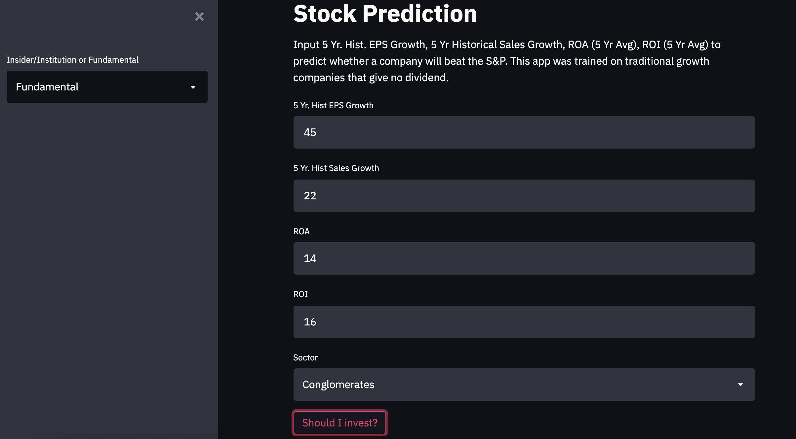
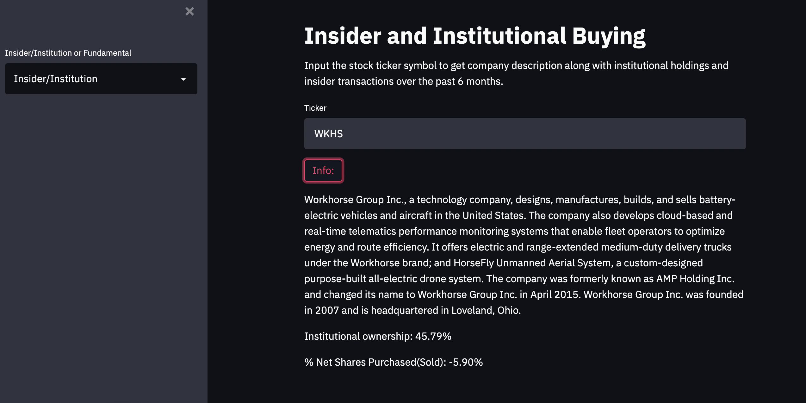

We use the stock screener from Zacks.com to build a list of publicly traded companies that are considered "growth stocks". A Python notebook is used for EDA and 
building the model. Our response is relative price change which compares the stocks performance to the S&P. We also build a simple web app with Streamlit (with a lot 
of help from the Python Engineer channel on YouTube). The app allows a user to input some fundamentals about the stock and check whether they should invest or not.

Finally, BeautifulSoup is used to scrape company description, insider transactions, and instituitonal holdings from Yahoo Finance.

